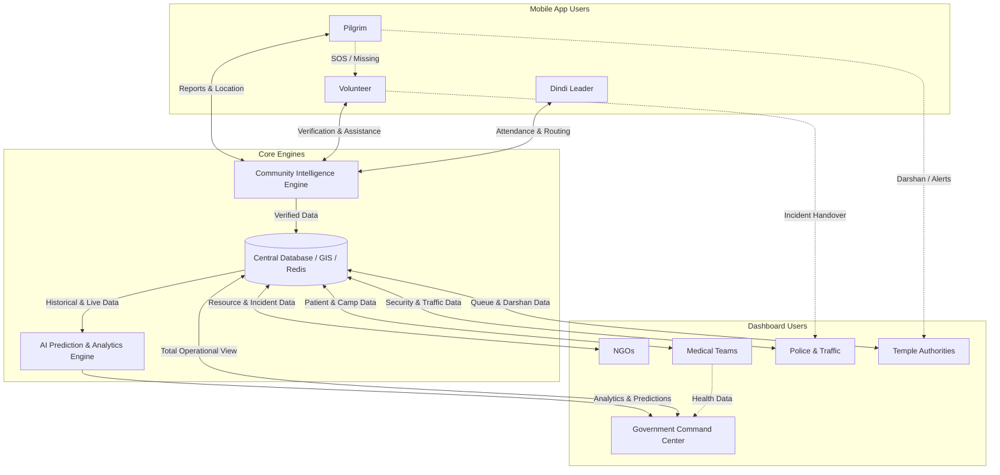
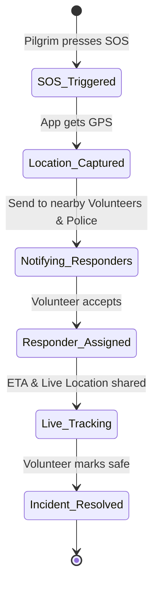
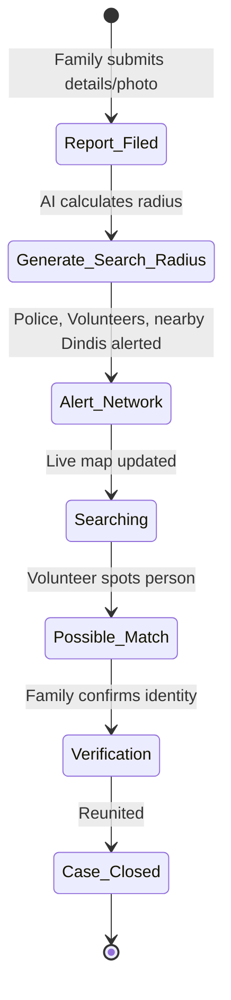

# WariMitra Platform: Features & Architecture

This document provides a comprehensive overview of the features, modules, and interconnectivity of the WariMitra platform, based on the complete development documentation.

## 1. Platform Ecosystem & Connectivity

WariMitra is designed as a unified digital ecosystem where every stakeholder sees only the information relevant to their role while contributing to a common source of truth.

### Stakeholder Connectivity Diagram

### Stakeholder Information Matrix
- **Pilgrims** provide crowdsourced reports (water, crowd) to the *Community Intelligence Engine* and receive verified alerts, navigation, and darshan updates from *Temple* & *Government*.
- **Volunteers** act as first responders, verifying pilgrim reports, and escalating critical issues to *Police* and *Medical Teams*.
- **Dindi Leaders** manage their groups, sharing movement data with *Government* and sending broadcast alerts to their *Pilgrims*.
- **NGOs** update resource availability (food/water) which is then routed to *Pilgrims* and *Volunteers* via live maps.
- **Medical Teams** manage health camps and dispatch ambulances based on SOS requests from *Pilgrims* and *Volunteers*.
- **Police** manage road blocks and missing person searches, updating the *Central Database* which informs *Pilgrim* navigation.
- **Temple Authorities** manage queue slots and entry gates, broadcasting expected wait times to *Pilgrims*.
- **Government** monitors everything via AI predictions (crowd surges, stampede risks) and coordinates all agencies.

---

## 2. Core Modules & Feature List

### 2.1 Pilgrim Module (Mobile App)
*Targeted at regular pilgrims, elderly, women, and child guardians.*
- **Authentication:** OTP-based login, profile setup, and language selection (Marathi, Hindi, English).
- **Home Dashboard:** Today's route, weather widget, journey progress, and quick action buttons (Water, Food, Medical, Toilet, Shelter).
- **Navigation & GIS:** Live maps, offline maps, route guidance, nearby services locator.
- **Emergency (SOS):** One-tap SOS button sharing GPS location, notifying nearby volunteers, medical teams, and family.
- **Family Locator:** Consent-based live location sharing, safe zone geofencing, separation alerts.
- **Voice Assistant:** Hands-free voice commands ("Find nearest water", "Call help") with offline support and text-to-speech.
- **Temple Integration:** Live queue status, estimated waiting time, darshan slot booking.
- **Missing Person:** Report missing family members, track search status.
- **Community Intelligence:** Report incidents (water shortage, road block), validate others' reports.
- **Accessibility:** Large buttons, high contrast, text-to-speech, offline-first.

### 2.2 Volunteer Module (Mobile App)
*Targeted at registered ground volunteers.*
- **Task Management:** Receive and accept assigned tasks (e.g., medical assist, crowd control).
- **Incident Verification:** Verify community-reported incidents to build trust scores.
- **Reporting:** Submit detailed incident reports (photos, GPS) for traffic, medical, or resource shortages.
- **Emergency Assist:** Receive nearby SOS alerts and navigate to the pilgrim in need.
- **Broadcast:** Send immediate local updates to nearby pilgrims.

### 2.3 Dindi Leader Module (Mobile App)
*Targeted at group organizers.*
- **Member Management:** Register members, assign volunteers, track individual health alerts.
- **Attendance Tracking:** QR scan, NFC, or GPS check-in to ensure no member is left behind.
- **Live Location Tracking:** See distribution of Dindi members on a map.
- **Broadcasts:** Send voice or text announcements to all Dindi members.
- **Resource Requests:** Pre-request food, water, or medical camps for the group.

### 2.4 NGO Module (Web / Mobile)
*Targeted at resource providers.*
- **Resource Registration:** Register food camps, water tankers, shelters, and medical kits.
- **Inventory Management:** Track real-time stock levels, consumption, and expiry.
- **Demand Analytics:** View AI-predicted resource demand along the route.
- **Volunteer Assignment:** Deploy NGO volunteers based on skills and location.

### 2.5 Medical Module (Web / Mobile)
*Targeted at Doctors, Nurses, Ambulance Drivers, Health Officials.*
- **Health Camp Dashboard:** Monitor bed capacity, waiting queues, and available staff.
- **Patient Management:** Digital health records, vitals tracking, prescriptions, discharge/referrals.
- **Ambulance Tracking:** Live dispatch, ETA calculation, case assignment.
- **Emergency Handling:** Direct integration with pilgrim SOS alerts and volunteer escalations.

### 2.6 Police & Traffic Module (Web Dashboard)
*Targeted at Law Enforcement & Traffic Controllers.*
- **Traffic Management:** Log road closures, create diversions, monitor emergency corridors.
- **Crowd Monitoring:** Heatmaps, density alerts, stampede risk monitoring.
- **Missing Person Operations:** Manage search radius, deploy patrol units, face matching (future).
- **Patrol Management:** Track active police units, assign incidents.
- **Public Alerts:** Issue authoritative weather, security, and routing announcements.

### 2.7 Temple Management Module (Web Dashboard)
*Targeted at Temple Administrators and Security.*
- **Queue Management:** Monitor active queue lengths, update entry/exit status, dynamic slot allocation.
- **Crowd Control:** VIP management, emergency lockdown triggers, evacuation routing.
- **Announcements:** Broadcast queue wait times and darshan updates to the Pilgrim app.
- **Lost & Found:** Track found items and missing persons inside temple premises.

### 2.8 Government Command & Control (Web Dashboard)
*Targeted at District Collectors, SDM, Disaster Management.*
- **Executive Overview:** High-level metrics (total pilgrims, active incidents, available resources).
- **GIS Heatmap:** Consolidated map showing crowd density, incidents, and resources.
- **AI Decision Support:** AI-generated recommendations (e.g., "Deploy water tanker to Village A").
- **Reporting:** Auto-generated compliance and incident reports.

---

## 3. Key Technical Innovations

### 3.1 Community Intelligence Engine (CIE)
A crowdsourced verification system:
- **Input:** A pilgrim reports a water shortage.
- **Process:** The CIE assigns a confidence score based on the reporter's trust level and corroborating reports. It dispatches a nearby volunteer to verify.
- **Output:** Once verified, the dashboard is updated, and the AI routes a water tanker.

### 3.2 Smart Temple Queue Management
An AI-driven flow controller:
- **Input:** Gate capacity, entry rate, exit rate.
- **Process:** Calculates expected wait time `(Queue Size x Avg Darshan Time) / Processing Rate`.
- **Output:** Sends live ETA to pilgrims; balances load by suggesting alternate gates.

### 3.3 Artificial Intelligence Engine (AIE)
WariMitra uses multiple AI models to predict and prevent disasters:
1. **Crowd Prediction:** Predicts surges 15-60 mins in advance using Time Series Forecasting.
2. **Resource Prediction:** Predicts water/food demand based on temperature, crowd size, and historical data.
3. **Heat Stroke Prediction:** Identifies high-risk demographics using weather and walking distance.
4. **Traffic Prediction:** Suggests diversions based on current road blocks and crowd movement.
5. **Missing Person Prediction:** Calculates expanding search radiuses based on time elapsed and walking speed.
6. **Digital Twin:** A full simulation of the Wari allowing officials to run "What if?" scenarios (e.g., "What if heavy rain starts?").

---

## 4. Workflows & State Machines

### SOS Emergency Workflow

### Missing Person Workflow

